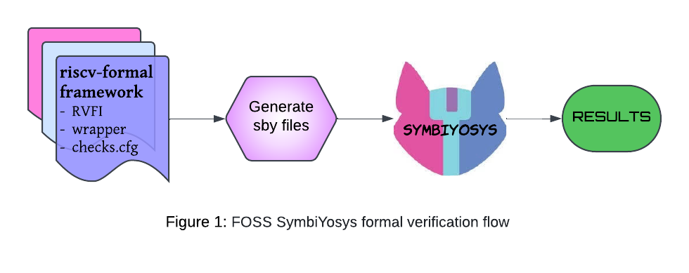

# RISC-V Formal Verification Framework Extension for Synopsys VC Formal

This repository is an **extension** of the official [riscv-formal](https://github.com/YosysHQ/riscv-formal) repository. It integrates the RISC-V formal verification framework with **Synopsys VC Formal tool**, enabling verification of RISC-V cores. This project focuses on providing an implementation workflow and examples for leveraging the VC Formal toolset alongside the existing framework.

## Flow Diagrams

### 1. FOSS SymbiYosys Formal Verification Flow

This flow demonstrates the formal verification process using the riscv-formal framework with the open-source SymbiYosys tool. It consists of components like RVFI, the wrapper, and `checks.cfg`. These components are used to generate `.sby` files, which are then processed by SymbiYosys. The tool runs the verification checks and produces the final results, ensuring that the RISC-V implementation adheres to formal specifications. This flow represents a streamlined, FOSS-based approach to formal verification.



---

### 2. Synopsys VC Formal Verification Flow

This flow illustrates the modified process, where the riscv-formal framework is used with Synopsys VC Formal tool. The `.sby` files from the riscv-formal framework are first converted to `.tcl` scripts using the custom `sby to tcl` converter before being processed by VC Formal to generate verification results.


## Features

### 1. **Integration with Synopsys VC Formal**
- **Property Checking and Bug Hunting**: Utilizes Synopsys VC Formal to perform property checking and identify bugs in the RISC-V core design.

- **.tcl Script Generation**: Python scripts automatically generate `.tcl` files compatible with VC Formal from `.sby` files.

- **Automated Makefile Generation**: A `Makefile` is created to organize and run multiple formal verification checks efficiently.

### 2. **Enhanced Automation**
- **(Pre-Processing) `.sby` File Conversion**: The `sby_to_tcl.py` Python script processes `.sby` files, converting them into `.tcl` files that are ready for formal verification. Additionally, it generates a `Makefile` to automatically run all checks in batch mode.

- **(Processing) Error and Warning Handling**: The `vcf_cexdata.sh` script collects and processes error and warning messages from VC Formal runs, saving them in structured files (`warnings.txt`, `errors.txt`).

- **(Post-Processing) Results Categorization and Formatting**: The `vcf_res_process.py` script parses the results of the verification, categorizes assertions (PASS/FAIL/INCONCLUSIVE), and formats them into readable summaries for further analysis.

### 3. **Easy Integration and Setup**
- **Flexible Workflow**: The entire formal verification process is managed through a single `Makefile`, allowing users to trigger different stages of the verification process with simple commands like `make vcf_check`, `make vcf_clean`, etc., eliminating the need to remember and execute multiple commands manually.

## Requirements

1. **Tools**:
   - Synopsys VC Formal
   - Python (3.x)
   - Bash (for shell scripting)
   - Yosys (optional)

## Running the Example SCRV32I Processor (For Understanding the Workflow)

1. Clone the Repository
   ```bash
   git clone https://github.com/Chaotic-VRBlue/riscv-formal-vc-formal-extension.git
   cd riscv-formal-vc-formal-extension
   ```

2. Navigate to the Core and Clean Previous Files and Results
   ```
   cd cores/scrv32i
   make vcf_clean
   ```

3. Run All Checks Automatically and View Results
   ```
   make vcf_check
   ```

   Once the process is complete, the terminal will display results in the following order:
   - Warnings
   - Errors
   - Verification results (PASS/FAIL/INCONCLUSIVE/UNKNOWN; If failed to run)

   These outputs are also saved in the `vcf_cexdata` folder for later review.

4. *(Optional)* Run a Specific Check:
   To run a specific formal verification check, use the following commands:
   ```
   cd vcf/{check_name}
   vcf -f {check_name}.tcl -batch
   ```
   This runs the selected check in **batch mode** and generates a result file named `{check_name}_results.txt`, where you can review the verification results.

   If you want to run the check directly in **GUI mode** for interactive debugging, use:
   ```
   vcf -f {check_name}.tcl -verdi
   ```
   This command launches **Verdi**, allowing you to visually analyze results and debug in an interactive environment.

5. View Waveforms in GUI Mode for Debugging:
   If you encounter a failing check or wish to analyze waveforms for a specific check:
   ```
   cd vcf/{check_name}
   vcf -restore -session {check_name}_results
   ```
   ```
   start_gui
   ```
   Since the formal verification for this check has already been run, there is no need to rerun it. Simply restore the session to view the waveforms in **GUI mode**. *Note that only one check can be analyzed in GUI mode at a time*.

6. Fix Bugs and Rerun Checks:
After debugging and making necessary fixes, you can rerun the verification. However, ensure you clean the previous results first:
   ```
   make vcf_clean
   make vcf_check
   ```
7. *(Optional)* Customize Checks to Run or Skip (do this before running):
You can configure which checks to run or skip by creating configuration files in the `vcf_checks_config` folder within the core directory (e.g., `cores/scrv32i`):

   - Case 1: Skip Specific Checks -
Create a file named `checks_to_skip.txt` and list the checks to skip, each separated by a space.
   - Case 2: Run Specific Checks Only -
Create a file named `checks_to_run.txt` and list the checks to run, separated by spaces.
   - Case 3: Default Mode (Run All Checks) -
If no configuration files are present, all checks will run by default.
   - Case 4: Conflict Between Files -
If both `checks_to_skip.txt` and `checks_to_run.txt` exist simultaneously, the program will terminate with an error message indicating that this setup is not supported.

## Configuring a New RISC-V Processor

1. First, refer to the `riscv-formal` repository and follow the steps outlined in the [riscv-formal guide](https://github.com/YosysHQ/riscv-formal?tab=readme-ov-file#configuring-a-new-risc-v-processor). Complete everything up to step 5. You don't need to run step 5, as it involves using an open-source tool. For our purpose, we will run it using the VC Formal tool, so step 5 can be skipped. If you're interested, you can explore it, but it's not required for this process.

2. Once the `RVFI` (RISC-V Formal Interface), `wrapper.sv` file, and `checks.cfg` file are implemented for your RISC-V processor as per the steps in the `riscv-formal` repository, you can proceed with running the RISC-V formal framework for your core on the Synopsys VC Formal Tool.

   *(Note: You may need to refer to the entire repository to complete this part, not just the section I linked here.)*

3. Copy the `vcf_cexdata.sh` and `Makefile` files from the `scrv32i` folder into your core folder.

4. Navigate to your core directory and run:
   ```bash
   cd cores/{core}
   make vcf_clean
   make vcf_check
   ```

   Once the process is complete, the terminal will display results in the following order:
   - Warnings
   - Errors
   - Verification results (PASS/FAIL/INCONCLUSIVE/UNKNOWN - If failed to run)

5. Then you can utilize features such as running specific checks (including in GUI mode), launching the GUI, and customizing checks to run or skip, as shown in the 'Running the Example SCRV32I Processor (For Understanding the Workflow)' section above.

## Notes
- The `checks` and `insns` folders in this repository are identical to those in the [riscv-formal](https://github.com/YosysHQ/riscv-formal) repository. That repository is the master repository for riscv-formal, and any future updates to the framework should be referred to there.

- This repository extends the `riscv-formal` framework to enable its use with the Synopsys VC Formal Tool. Please note that any significant changes in the main `riscv-formal` repository, or modifications to the `.sby` or `.tcl` file formats used by the tools, may lead to incompatibilities with this extension. Updates will be required to maintain compatibility with future changes.

- Only the `vc_formal` folder in the root directory, the `vcf_cexdata.sh` file in the `scrv32i` folder, and a few additions to the `Makefile` inside the `scrv32i` directory were created by me to implement this extension.

## File Descriptions
This section provides detailed information about the key files in this repository. Each file plays a specific role in the extension of the riscv-formal framework to work with Synopsys VC Formal.

### 1. `sby_to_tcl.py` *Pre-Processing Stage*

The `sby_to_tcl.py` script simplifies the use of Synopsys VC Formal by automating the conversion of `.sby` files into `.tcl` scripts and creating a `Makefile` for managing and running multiple verification checks efficiently.

- **Automates Batch Execution Setup**: Creates a `Makefile` to enable running all `.tcl` scripts with a single command, eliminating the need to execute each `.tcl` file manually one by one.  

- **Converts `.sby` to `.tcl`**: Transforms SymbiYosys `.sby` files into `.tcl` scripts tailored for Synopsys VC Formal, ensuring compatibility while maintaining the original verification properties and configurations.  

- **Handles Multiple `.sby` Files**: Processes all `.sby` files in the `checks` directory, making it easy to scale the workflow for multiple checks in a formal verification project.  

- **Organizes Verification Workflow**: Generates a dedicated `vcf` directory, where subdirectories and files related to the verification checks are stored systematically.  

- **Facilitates Efficient Debugging**: Prepares the necessary structure for further scripts (`vcf_cexdata.sh`, `vcf_res_process.py`) to handle results seamlessly.  

This script bridges the gap between open-source SymbiYosys tool and the proprietary Synopsys VC Formal tool, offering an automated and efficient approach for batch verification of RISC-V cores.

### 2. `vcf_cexdata.sh` *Processing Stage*

The `vcf_cexdata.sh` script ensures efficient handling of warnings and errors during formal verification checks. Its main purpose is to call the `Makefile` created by the `sby_to_tcl.py` script and log warnings and errors separately for all checks, avoiding the issue of logs being overwritten when multiple checks are run sequentially. By capturing and organizing the logs, the script streamlines debugging and verification processes.

- **Purpose-Built for Log Management**: Invokes the `Makefile` internally to process all checks while maintaining separate logs for warnings and errors. This resolves the limitation of overwritten logs when using the `make` command directly.  

- **Detailed Error and Warning Logs**: Dynamically tracks and records unique warnings and errors, including the specific checks in which they occur. These logs are stored in the `vcf_cexdata` directory (`warnings.txt` and `errors.txt`) for easy access. Uses associative arrays to consolidate repeated warnings or errors, providing a concise summary with occurrence counts and associated checks. Example of log format:
  - `vcf_cexdata.sh: {warning/error description as reported by the tool} (Encountered {Number} times, Checks: check1, check2, ...)`
    - This format makes it clear how often a warning or error appears and which checks are related to it. For instance, if a specific warning occurs during two different checks, it will show up as:
    - `vcf_cexdata.sh: Missing connection in module (Encountered 2 times, Checks: check1_name, check2_name)`

- **Real-Time and Organized Execution**: Outputs warnings and errors to the console during execution for monitoring (*prefixing them with the script name*), while also ensuring that the logs remain structured and categorized.
  
- **Seamless Integration**: Works in harmony with the `Makefile` to enhance the formal verification workflow by ensuring that no critical log information is lost.  

- **Ensures Clean Execution**: Automatically cleans up empty log files if no warnings or errors are found, maintaining a clutter-free directory structure.  

- **Supports Flexible Usage**: Includes a static mode for processing pre-generated log files, making it adaptable for post-run analysis. To use static mode, simply uncomment the relevant block in the script and comment out the block that processes dynamic output from `make`. 
   - Static Mode block starts with this comment: *# Static Mode Support:*
   - Dynamic Mode block starts with this comment: *# Run make and process output dynamically*

This script is an essential component for managing formal verification workflows, offering clarity, structure, and automation in handling log data.

### 3. `vcf_res_process.py` *Post-Processing Stage*

The `vcf_res_process.py` script is designed to process formal verification results, providing a high-level overview by extracting and summarizing key information from the individual result files of each check.

Each check generates a detailed result file (`{check_name}_results.txt`) in its respective directory under the `vcf` folder. The primary motivation for creating this script is to aggregate the most important results from all checks into one summary file (`results.txt`) located in the `vcf_cexdata` directory. This consolidated file allows users to quickly assess the overall verification outcomes.

- **Aggregating Results**: This script extracts the "Summary Results" section from each `{check_name}_results.txt` file and consolidates the relevant details, such as assertion status (`PASS`, `FAIL`, `INCONCLUSIVE`), into a single output file. This eliminates the need to manually inspect individual result files for every check.

- **Formatted Output**: The results are presented in a tabular format, displaying key data for each check, such as property types, the number of assertions found, and their sub-results. The structured output enables quick identification of issues and areas requiring further investigation.

- **Final Summary**: At the end of the output file, a summary section provides a quick overview of the total number of checks and their status categories: `PASS`, `FAIL`, `INCONCLUSIVE`, `UNKNOWN` (indicating checks that failed to run).

- **Processing Multiple Checks**: The script automatically scans all checks within the `vcf` folder, ignoring unnecessary directories. It parses and categorizes each check's results, writing the aggregated data to the `vcf_cexdata/results.txt` file.

- **Interactive Debugging Support**: By reviewing the consolidated results file, users can easily decide which specific check requires more detailed investigation. They can navigate to the corresponding check folder and launch a GUI for that check to perform interactive debugging or visualization, streamlining the debugging process.

This script simplifies the review and analysis of formal verification results, providing both a high-level overview and a pathway for detailed debugging as needed.

### 4. `Makefile` *Automation of all 3 Stages*

The `Makefile` serves as the central point for automating the formal verification process, integrating various scripts into a single streamlined workflow. Its primary motivation is to provide a **single-command solution** to generate, execute, and process results for formal checks, significantly reducing manual effort and ensuring consistency across all steps.

By consolidating multiple steps—check generation, execution, and result aggregation—the `Makefile` simplifies the workflow, making it accessible and efficient for users handling large numbers of formal checks.

- **Generation of Checks (Pre-Processing Stage)**: Calls `genchecks.py` to create required verification checks and `sby_to_tcl.py` to convert `.sby` files into `.tcl` files for VC Formal compatibility.

- **Execution of Formal Verification (Processing Stage)**: Invokes `vcf_cexdata.sh` to run checks and collect warnings in `warnings.txt` and errors in `errors.txt` during the verification process.

- **Result Processing and Aggregation (Post-Processing Stage)**: Uses `vcf_res_process.py` to process and summarize verification results, creating a consolidated output in `results.txt`.

- **Terminal Output**: Once the verification is complete, the `Makefile` displays warnings, errors, and results in the terminal for quick review, allowing users to assess the verification status without opening additional files. The warnings and errors are shown first, followed by a summary of the results.

- **Clean-Up Workflow**: Includes a target to clean up all generated files and reset the workspace for the next verification cycle.

These targets ensure a smooth and organized verification workflow, allowing users to focus on analyzing results rather than managing multiple scripts and intermediate files.
